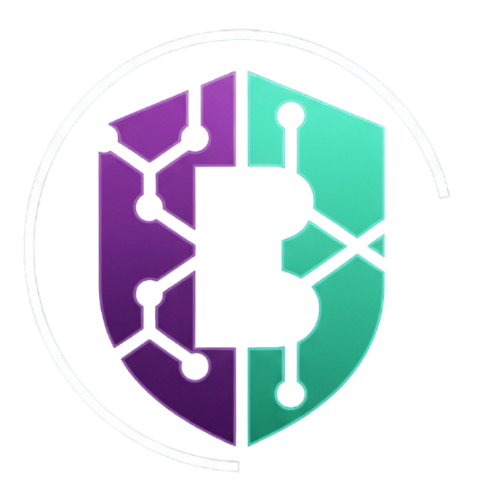

# TransferCripto — Onboarding PJ

> Protótipo de onboarding para abertura de conta PJ em uma corretora de criptoativos.

## Sobre o Projeto
Este projeto foi desenvolvido como resposta ao desafio técnico proposto, com o objetivo de criar um fluxo de onboarding intuitivo, responsivo e integrado a APIs reais, simulando o cadastro de uma empresa (Pessoa Jurídica) em uma corretora de criptoativos.

A experiência foi construída com foco em **UX mobile-first**, **validação inteligente de formulários** e **integração com serviços externos** como ViaCEP e ReceitaWS.

O uso de Agentes de IAs e ferramentas similares foram encorajados para a conclusao do desafio

---
Desing e UX

O layout e o fluxo de telas foram gerados com auxílio do UX Pilot, ferramenta de IA para design de interfaces.
Abaixo estão os prompts utilizados:

```
Faça uma tela inicial de registro, onde são requisitados os seguintes dados:
CNPJ, nome da empresa, nome fantasia, moeda cripto que deseja operar (BTC, ETH, USDC, USDT), telefone com DDD, e-mail, senha e confirmação de senha.
O campo de criptomoeda deve ser um dropdown (lista suspensa), e não botões de escolha.
A interface deverá seguir aproximadamente este padrão de cores:
Fundo da navbar/rodapé: #2D1B4E (roxo escuro)
Botão "Criar Conta": #00C9B1 (teal/verde-água)
Texto escuro: #1A0A3B (roxo muito escuro)
Destaque de link: #00C9B1 (mesmo teal)
Fundo da página: #FFFFFF
Na parte superior, crie uma barra de progresso do registro, mostrando em qual etapa do cadastro o usuário está.
A página deve conter apenas os elementos relacionados ao registro.
```

```
Crie outra tela.
Tela para registro de sócios: a tela deverá solicitar nome completo, CPF, endereço completo, nacionalidade e participação do sócio.
Deve haver também uma checkbox indicando se o sócio é PEP.
Inclua uma área para depósito/upload de arquivos. Logo abaixo, apresente uma lista dos documentos que foram enviados, com um ícone de lixeira ao lado para removê-los.
```
```
Crie outra tela, separada do fluxo de registro que estamos estabelecendo.
Essa tela será para conta já existente. Deve haver um aviso informando "Conta já existente".
Logo abaixo, inclua campos para e-mail e senha, além de um botão para recuperar a senha.

```

OBS: Os prompts foram melhorados com o chatGPT (GPT-5.3)

Logo gerada com o Nano Banana

-

-

Prompt Utilizado:
```
Crie uma logo para um site de negociação de criptoativos. A logo deve ter alguma associação visual com a letra "B" do Bitcoin, podendo ser uma adaptação ou estilização desse símbolo.

O design deve transmitir tecnologia, segurança e modernidade.
Prefira um estilo minimalista e profissional, adequado para uso em um site e em uma navbar.

Utilize uma paleta de cores baseada em:

    Roxo escuro (#2D1B4E)

    Verde teal (#00C9B1)

    Branco (#FFFFFF)

A logo deve funcionar bem em fundo claro e escuro, ter boa legibilidade em tamanhos pequenos e possuir um visual moderno, relacionado ao universo de blockchain e criptomoedas.
```

----

## Stack Tecnológica

| Tecnologia | Versão | Motivo |
|-----------|--------|--------|
| **Vue 3** | ^3.4 | Composition API, reatividade moderna |
| **Pinia** | ^2.1 | Gerenciamento de estado simples e tipado |
| **Bootstrap 5** | ^5.3 | Grid responsivo mobile-first |
| **SASS** | ^1.7 | Customização de variáveis e temas |
| **Yup** | ^1.3 | Validação declarativa de schemas |
| **Vee-Validate** | ^4.x | Integração do Yup com Vue forms |
| **Vue Router** | ^4.x | Navegação entre etapas do onboarding |
| **Axios** | ^1.x | Requisições HTTP para APIs externas |


## Ferramentas Utilizadas

Kiro (Claude Sonnet 4.5)
IDE inteligente usada como agente de desenvolvimento: geração de componentes Vue, arquitetura do projeto, refatorações e revisão de código em tempo real 

Claude (Anthropic) 
Suporte a decisões de arquitetura, geração de schemas Yup, validações e lógica de negócio

ChatGPT (OpenAI)
Apoio na escrita de prompts, brainstorming de fluxo de UX e revisão de textos

UX Pilot
Geração do fluxo de UX e layout das telas mobile

Nano Banana(Google)
Criação da logo do projeto.

### Sobre o uso do **Kiro**
O Kiro foi utilizado como IDE inteligente principal durante o desenvolvimento, com o modelo Claude Sonnet 4.5 como agente de código. Ele foi especialmente útil para:

- Geração inicial dos componentes de cada etapa do onboarding
- Sugestões de estrutura de pastas e separação de responsabilidades
- Refatoração de código repetitivo (ex: campos de formulário)
- Revisão de integração entre Pinia store e componentes Vue


## APIs Integradas

| API | Endpoint | Finalidade |
|-----|----------|-----------|
| **ViaCEP** | `https://viacep.com.br/ws/{cep}/json/` | Preenchimento automático de endereço |
| **ReceitaWS** | `https://receitaws.com.br/v1/cnpj/{cnpj}` | Busca de dados da empresa pelo CNPJ |


## Demonstração
(Link Video)

