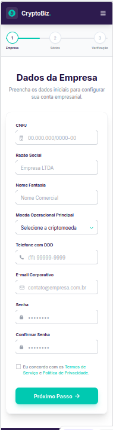

Projeto de desenvolvimento de um Onbording mobile-first para abertura de contas PJ em uma corretora de cripytoativo.
Stack que sao obrigatorias:
Vue 3 + Composition API, Pinia, Bootstrap 5, SASS, Yup

Paletas de cores versao light(cores da transferbank)
// Fundos
$bg-primary:  #FFFFFF;
$bg-card:     #F8F9FA;
$bg-surface:  #F1F3F5;

// Acentos
$accent-primary:   #00C9B1;  // teal
$accent-secondary: #7B2FBE;  // roxo

// Texto
$text-primary: #1A1A2E;
$text-muted:   #6B7280;

// Feedback
$success: #10B981;
$danger:  #EF4444;
$warning: #F59E0B;

// Overrides Bootstrap
$primary:                  $accent-primary;
$body-bg:                  $bg-primary;
$body-color:               $text-primary;
$border-radius:            12px;
$font-family-sans-serif:   'Inter', sans-serif;
$input-bg:                 $bg-surface;
$input-color:              $text-primary;
$input-border-color:       #E2E8F0;
$input-focus-border-color: $accent-primary;

Com uma estrutura de pastas baseado no "Feature-based structure"

Tendo alguns requisitos obrigatorios e outros opcionais

Req 1 — UX com IA (opcional)
Usar ferramenta como UX Pilot para gerar design. Usar nano banana para logo.

Propt usado para gerar desing

´´´Faça uma tela de  inicial de registro, onde é requisitado o CNPJ, nome da empresa, nome fantasia, Moeda cripto que deseja operar (BTC, ETH, USDC, USDT), telefone com DDD, email, senha e confirmação de senha.
seria esses o campo da cript seria um drop e nao um botao de escolha, 

devera seguir mais ou menos esse padrao de cores

Fundo navbar/rodapé#2D1B4E (roxo escuro)Botão "Criar Conta"#00C9B1 (teal/verde água)Texto escuro#1A0A3B (roxo muito escuro)Destaque link#00C9B1 (mesmo teal)Fundo página#FFFFFF
Na parte superior crie uma barra para o progresso de registro, mostrando qual parte o usuario esta,
a pagina contem somente para registro

Crie uma outra tela 
Tela para registro de sócios (para simplificar só PF): A tela deverá pedir nome completo, CPF, endereço completo, nacionalidade e participação do sócio, se é PEP, e permitir anexo de múltiplos documentos (Ex: identidade frente e verso, cnh frente e verso)

Faça uma outra tela, so que separada do fluxo que estamos estabelecendo
Tela para conta já existente. Ela sempre deverá aparecer quando o e-mail 
Sa uma tela onde usuario podera recuperar senhar, ou entrar apatir daquela tela

Para esse caso, crie uma outra tela de formato de login ´´´

gerando esse resultado:

Req 2 — Telas (OBRIGATÓRIO)

Tela A: CNPJ, razão social, nome fantasia, criptos, telefone, e-mail, senha com indicador de força
Tela B: "Conta já existente" — aparece quando e-mail exists@transferpay.exchange é usado
Tela C: Sócios — nome, CPF, endereço, nacionalidade, participação %, PEP, upload docs (drag n drop). Participação deve somar 100%.
Tela D: Upload PDF contrato social + preview

Req 3 — Validação e Cache (OBRIGATÓRIO)

Yup para validar todos os campos (CPF, CNPJ, e-mail, senha, obrigatórios)
Não permite avançar com campos inválidos
Pinia + localStorage para cachear dados entre refreshes
Limpar cache ao finalizar onboarding

Req 4 — Autocomplete por CNPJ e CEP (OBRIGATÓRIO)

API BrasilAPI: preenche razão social, fantasia, sócios automaticamente
Bloquear empresas com situação diferente de "ATIVA"
API ViaCEP: autocomplete de endereço a partir do CEP

Req 5 — DDD → Estado + Bandeira (opcional, PRIORIZADO)

Ao digitar o telefone, identificar o estado pelo DDD
Mostrar bandeira do estado ao lado do campo

Req 6 — Cotação de Moedas (opcional, PRIORIZADO)

Mostrar custo de setup da conta na tela 1
Calculado a partir de $100 USD, 0.00153 BTC ou 0.521 ETH
Exibir em reais com 2 casas decimais (arredondando pra cima)
Atualizar a cada 5 segundos
Aplicar 1% de spread + 3.5% de IOF

Fórmula:
custo_base = valor_em_USD × cotação_BRL_USD
com_spread = custo_base × 1.01
com_iof    = com_spread × 1.035
final      = ceil(com_iof × 100) / 100

Req 7 — Upload Contrato Social PDF (opcional, PRIORIZADO)

Tela para upload de PDF
Preview do PDF inline no navegador

Req 8 — IA para análise do contrato (opcional, PRIORIZADO)

OCR do PDF (Tesseract.js ou pdf.js)
Enviar texto extraído para LLM (OpenAI/Claude)
Verificar: sócios presentes, assinaturas, cláusulas essenciais
Lógica fuzzy para calcular índice de confiança
Reprovar cadastro se contrato não for confiável

---
Api usadas
BrasilAPI: https://brasilapi.com.br/api
ViaCEP:    https://viacep.com.br/ws

Estruturas de pastas
src/
├── views/          # todas as telas juntas
├── services/       # todos os serviços juntos
├── stores/         # todas as stores juntas
└── components/

--
Como sera feito o REQ 5 das bandeiras
como nao foi achado nenhuma lib que tras estados do brasil, faremos o seguinte, um grande Json com todos os DDD do brasil
AC: 68
AL: 82
AP: 96
AM: 92, 97
BA: 71, 73, 74, 75, 77
CE: 85, 88
DF: 61
ES: 27, 28
GO: 61, 62, 64
MA: 98, 99
MT: 65, 66
MS: 67
MG: 31, 32, 33, 34, 35, 37, 38
PA: 91, 93, 94
PB: 83
PR: 41, 42, 43, 44, 45, 46
PE: 81, 87
PI: 86, 89
RJ: 21, 22, 24
RN: 84
RS: 51, 53, 54, 55
RO: 69
RR: 95
SC: 47, 48, 49
SP: 11, 12, 13, 14, 15, 16, 17, 18, 19
SE: 79
TO: 63

Sendo esses
Ficando mais ou menos assim 
const DDD_MAP = {
  11: { estado: 'SP', nome: 'São Paulo' },
  41: { estado: 'PR', nome: 'Curitiba' },
  // ...todos os DDDs
}
se faltar algum na lista add

Todas as bandeiras estao nesse caminho aqui onboarding/crypto-onboarding/src/assets/flags
La esta cada uma nomeada com seu devido nome
De certa foma, o cost pode voltar o name ja informando o nome como nome do arquivo, COmo parana.png, ou qualquer outra exteção que tiver 
No campo de telefone aparecera a bandeira assim que for identificado o DDD que o usuario colocar, 
--

## ✅ Checklist de Implementação

### Requisitos Obrigatórios

#### ✅ Req 2 — Telas (100% completo)
- [x] **Tela A**: Registro da empresa
  - [x] CNPJ com formatação automática
  - [x] Razão Social
  - [x] Nome Fantasia
  - [x] Moeda cripto (dropdown: BTC, ETH, USDC, USDT)
  - [x] Telefone com DDD e formatação
  - [x] Email
  - [x] Senha com indicador de força visual (Fraca/Média/Boa/Forte)
  - [x] Confirmação de senha
  - [x] Checkbox de termos
  - [x] Barra de progresso (steps)
  - [x] Design mobile-first com cores TransferBank

- [x] **Tela B**: Conta já existente
  - [x] Redirecionamento quando email `exists@transferpay.exchange` é usado
  - [x] Rota `/existing-account` configurada
  - [x] Formulário de login
  - [x] Campo de senha com validação
  - [x] Opção de recuperação de senha
  - [x] Formulário de recuperação de senha
  - [x] Validação de email na recuperação
  - [x] Feedback visual (loading, sucesso, erro)
  - [x] Botão para usar outro e-mail

- [x] **Tela C**: Registro de sócios
  - [x] Nome completo
  - [x] CPF com validação
  - [x] CEP com autocomplete de endereço
  - [x] Endereço completo (rua, número, complemento, bairro, cidade, UF)
  - [x] Nacionalidade
  - [x] Participação % (valida soma = 100%)
  - [x] Checkbox PEP
  - [x] Upload de múltiplos documentos
  - [x] Drag & drop de arquivos
  - [x] Lista de sócios cadastrados
  - [x] Edição e remoção de sócios
  - [x] Indicador de participação restante

- [x] **Tela D**: Upload de contrato social
  - [x] Upload de PDF
  - [x] Preview do PDF inline no navegador
  - [x] Validação de tipo de arquivo (apenas PDF)
  - [x] Validação de tamanho (máximo 10MB)
  - [x] Drag & drop de arquivo
  - [x] Informações do arquivo (nome, tamanho)
  - [x] Botão para remover arquivo
  - [x] Finalização do cadastro
  - [x] Limpeza de cache ao finalizar

#### ✅ Req 3 — Validação e Cache (100% completo)
- [x] **Validação com Yup**
  - [x] CNPJ com dígitos verificadores
  - [x] CPF com dígitos verificadores
  - [x] Email formato válido
  - [x] Telefone formato (XX) XXXXX-XXXX
  - [x] Senha: mínimo 8 chars + 1 maiúscula + 1 número
  - [x] Confirmação de senha deve coincidir
  - [x] Participação societária soma = 100%
  - [x] Mínimo 1 documento por sócio
  - [x] Todos os campos obrigatórios validados
  - [x] Bloqueio de progresso com campos inválidos

- [x] **Cache com Pinia + localStorage**
  - [x] Dados salvos automaticamente
  - [x] Carrega dados ao abrir página
  - [x] Persiste após refresh (F5)
  - [x] Limpa cache ao finalizar onboarding

#### ✅ Req 4 — Autocomplete (100% completo)
- [x] **Autocomplete de CEP**
  - [x] Integração com ViaCEP
  - [x] Preenche: rua, bairro, cidade, estado
  - [x] Funciona na tela de sócios

- [ ] **Autocomplete de CNPJ** (código pronto, falta integrar)
  - [x] Serviço criado com ReceitaWS
  - [x] Serviço criado com BrasilAPI (alternativa)
  - [x] Validação de situação cadastral
  - [x] Extração de sócios do QSA
  - [x] Documentação de integração criada
  - [x] Integrar na RegisterView (adicionar `@blur="handleCnpjBlur"`)
  - [x] Autocomplete de razão social
  - [x] Autocomplete de nome fantasia
  - [x] Bloquear empresas com situação ≠ ATIVA
  - [x] Passar sócios para tela de sócios

### Requisitos Opcionais (Priorizados)

#### ✅ Req 5 — DDD → Estado + Bandeira (100% completo)
- [x] Mapa completo de DDDs brasileiros
- [x] Identificar estado pelo DDD automaticamente
- [x] Mostrar bandeira do estado ao lado do campo telefone
- [x] Mostrar sigla do estado (SP, RJ, etc.)
- [x] Tooltip com nome completo do estado
- [x] Design integrado com as cores do sistema

#### ✅ Req 6 — Cotação de Moedas (100% completo)
- [x] Integrar API de cotação (CoinGecko - gratuita, sem limite)
- [x] Mostrar custo de setup na tela 1
- [x] Calcular a partir de $100 USD, 0.00153 BTC ou 0.521 ETH
- [x] Exibir em reais com 2 casas decimais (arredondando pra cima)
- [x] Atualizar a cada 5 segundos
- [x] Aplicar 1% de spread
- [x] Aplicar 3.5% de IOF
- [x] Documentar fórmula em LaTeX no README

#### ❌ Req 7 — Upload Contrato Social PDF (100% completo)
- [x] Tela para upload de PDF
- [x] Preview do PDF inline no navegador
- [x] Validação de tipo de arquivo (apenas PDF)
- [x] Validação de tamanho (máximo 10MB)
- [x] Drag & drop
- [x] Informações do arquivo
- [x] Botão para remover e reenviar

#### ❌ Req 8 — IA para análise do contrato (0% completo)
- [ ] Integrar biblioteca de OCR (Tesseract.js ou pdf.js)
- [ ] Extrair texto do PDF
- [ ] Integrar API LLM (OpenAI/Claude)
- [ ] Criar prompt estruturado para análise
- [ ] Verificar sócios presentes no contrato
- [ ] Verificar assinaturas (digital ou gov.br)
- [ ] Verificar cláusulas essenciais
- [ ] Implementar lógica fuzzy para índice de confiança
- [ ] Reprovar cadastro se contrato não for confiável

---

## 🎯 Próximos Passos

### Prioridade Alta (Requisitos)
1. ~~**Completar Req 4 - Autocomplete de CNPJ**~~ ✅ **CONCLUÍDO**
2. ~~**Completar Req 2 - Tela B (Conta Existente)**~~ ✅ **CONCLUÍDO**
3. ~~**Implementar Tela D - Upload de Contrato**~~ ✅ **CONCLUÍDO**

### Prioridade Média (Requisitos Opcionais Priorizados)
4. **Req 6 - Cotação de Moedas** (~2-3h)
   - Integrar API de cotação
   - Implementar cálculo com spread e IOF
   - Atualização a cada 5 segundos

4. **Req 5 - DDD → Bandeira** (~1h)
   - Mapear DDDs para estados
   - Adicionar bandeiras

### Prioridade Baixa (Requisitos Opcionais Avançados)
5. **Req 7 - Preview de PDF** (~1h)
   - Implementar preview inline

6. **Req 8 - IA para Análise** (~4-6h)
   - OCR do PDF
   - Integração com LLM
   - Lógica fuzzy

---

## 📊 Status Geral do Projeto

| Requisito | Status | Percentual |
|-----------|--------|------------|
| Req 1 - UX com IA | ✅ Completo | 100% |
| Req 2 - Telas | ✅ Completo | 100% |
| Req 3 - Validação + Cache | ✅ Completo | 100% |
| Req 4 - Autocomplete | ✅ Completo | 100% |
| Req 5 - DDD → Bandeira | ✅ Completo | 100% |
| Req 6 - Cotação Moedas | ✅ Completo | 100% |
| Req 7 - Upload PDF | ✅ Completo | 100% |
| Req 8 - IA Contrato | ❌ Não iniciado | 0% |

**Requisitos Obrigatórios**: 100% completo (4/4) ✅  
**Requisitos Opcionais Priorizados**: 75% completo (3/4)  
**Projeto Geral**: ~80% completo

